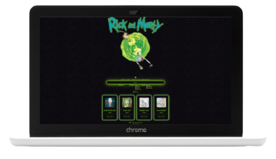

  

# **Rick and Morty Character Search**

## **About**

Module 3 final project of the Adalab Digital Frontend Development Bootcamp.

This is a responsive Rick and Morty character search web app developed with [](https://html.spec.whatwg.org/) [](https://www.w3.org/Style/CSS/) [](https://sass-lang.com/) [](https://www.ecma-international.org/ecma-262/) and [](https://es.reactjs.org/)

**[Project URL](https://anaguerraabaroa.github.io/rick-and-morty-character-search/#/)** is available on GitHub Pages.

## **Quick start guide**

Instructions to start this project:

## Installation

- Clone repository:

```
git clone [repository]
```

- Install NPM packages and dependencies:

```
npm install
```

- Run project on local server:

```
npm start
```

## **Features**

- React app
- Get characters from **[API](https://rickandmortyapi.com/api/character)**
- Components structure
- Render an alphabetically ordered character list with image, name and species
- Form with filters by name (uppercase and lowercase), species, status and gender
- Detailed character card new window using React Router with image, name, species, status, origin planet and number of episodes. Use icons to render species and status
- Prevent event default of form
- Render error messages when searched character doesn't exist or when the URL of detailed character card doesn't exist
- Save search when user enter on detailed character card and go back to form
- Loading component
- Save data on LocalStorage
- Grid character list layout
- Responsive app design for mobile, tablet and desktop devices

## **Usage**

### **1. App component**

- Handle app, state, lifecycle, filters and reset and create individual character card component

```javascript

function App() {
  const [isLoading, setIsLoading] = useState(false);
  const [characterList, setCharacterList] = useState([]);
  const [filterName, setFilterName] = useState(dataLocalStorage.name);
  const [filterSpecies, setFilterSpecies] = useState(dataLocalStorage.species);
  const [filterStatus, setFilterStatus] = useState(dataLocalStorage.status);
  const [filterGender, setFilterGender] = useState(dataLocalStorage.gender);

  useEffect(() => {
    setInLocalStorage(filterName, filterSpecies, filterStatus, filterGender);
  });

  useEffect(() => {
    setIsLoading(true);
    api.getDataFromApi().then((data) => {
      setCharacterList(data);
      setIsLoading(false);
    });
  }, []);

  const handleFilter = (data) => {
    if (data.name === "text") {
      setFilterName(data.value);
    } else if (data.name === "species") {
      setFilterSpecies(data.value);
    } else if (data.name === "status") {
      setFilterStatus(data.value);
    } else if (data.name === "gender") {
      if (data.checked === true) {
        const newFilterGender = [...filterGender];
        newFilterGender.push(data.value);
        setFilterGender(newFilterGender);
      } else {
        const newFilterGender = filterGender.filter((gender) => {
          return gender !== data.value;
        });
        setFilterGender(newFilterGender);
      }
    }
  };

  const getGender = () => {
    const characterGender = characterList.map((character) => {
      return character.gender;
    });

    const checkDuplicateGender = characterGender.filter((character, index) => {
      return characterGender.indexOf(character) === index;
    });

    const filteredGender = [...new Set(characterGender)];
    return filteredGender;
  };

  const filteredCharacters = characterList
    .filter((character) => {
      return character.name.toLowerCase().includes(filterName.toLowerCase());
    })
    .filter((character) => {
      if (filterSpecies === "all") {
        return characterList;
      } else {
        return character.species.toLowerCase() === filterSpecies;
      }
    })
    .filter((character) => {
      if (filterStatus === "all") {
        return characterList;
      } else {
        return character.status.toLowerCase() === filterStatus;
      }
    })
    .filter((character) => {
      if (filterGender.length === 0) {
        return characterList;
      } else {
        return filterGender.includes(character.gender);
      }
    });

  const handleClick = () => {
    setFilterName("");
    setFilterSpecies("all");
    setFilterStatus("all");
    setFilterGender([]);
  };

  const renderCharacterDetail = (props) => {
    const characterId = parseInt(props.match.params.id);
    const foundCharacter = characterList.find((character) => {
      return character.id === characterId;
    });
    if (foundCharacter) {
      return <CharacterDetail foundCharacter={foundCharacter} />;
    } else {
      return (
        <div className="error__route">
          <i className="error__route--icon fas fa-rocket"></i>
          <p className="error__route--text">
            We are sorry but you are trying to land on a nonexistent planet
          </p>
          <Link
            to="/"
            className="error_route--btn"
            title="Back to character list"
          >
            Return
          </Link>
        </div>
      );
    }
  };

```

### **2. Characters list API request component**

- Handle fetch API request

```javascript
const getDataFromApi = () => {
  return fetch("https://rickandmortyapi.com/api/character")
    .then((response) => response.json())
    .then((data) => {
      return data.results;
    });
};
```

### **3. FilterByName component**

- Handle filter by name component

```javascript
const FilterByName = (props) => {
  const handleFilter = (ev) => {
    const data = {
      name: ev.currentTarget.name,
      value: ev.currentTarget.value,
    };
    props.handleFilter(data);
  };

  return (
    <>
      <i className="form__icon fab fa-reddit-alien"></i>
      <label className="form__label" htmlFor="formText">
        Enter your favourite character
      </label>
      <input
        className="form__input--text"
        type="text"
        name="text"
        value={props.filterName}
        placeholder="ej: Rick"
        id="formText"
        onChange={handleFilter}
      />
    </>
  );
};
```

### **4. FilterBySpecies component**

- Handle filter by species component

```javascript
const FilterBySpecies = (props) => {
  const handleFilter = (ev) => {
    const data = {
      name: ev.currentTarget.name,
      value: ev.currentTarget.value,
    };
    props.handleFilter(data);
  };

  return (
    <div className="form__filter--species">
      <label className="species__label" htmlFor="species">
        Species:
      </label>
      <select
        className="species__input--select"
        id="species"
        name="species"
        value={props.filterSpecies}
        onChange={handleFilter}
      >
        <option value="all">All</option>
        <option value="human">Human</option>
        <option value="alien">Alien</option>
      </select>
    </div>
  );
};
```

### **5. FilterByStatus component**

- Handle filter by status component

```javascript
const FilterByStatus = (props) => {
  const handleFilter = (ev) => {
    const data = {
      name: ev.currentTarget.name,
      value: ev.currentTarget.value,
    };
    props.handleFilter(data);
  };

  return (
    <div className="form__filter--status">
      <label className="status__label">Status:</label>
      <div className="status__radio--wrapper">
        <label className="status__legend" htmlFor="status1">
          <input
            className="status__input--radio"
            id="status1"
            type="radio"
            value="all"
            name="status"
            onChange={handleFilter}
            checked={props.filterStatus === "all"}
          />
          All
        </label>
        <label className="status__legend" htmlFor="status2">
          <input
            className="status__input--radio"
            id="status2"
            type="radio"
            value="alive"
            name="status"
            onChange={handleFilter}
            checked={props.filterStatus === "alive"}
          />
          Alive
        </label>
        <label className="status__legend" htmlFor="status3">
          <input
            className="status__input--radio"
            id="status3"
            type="radio"
            value="dead"
            name="status"
            onChange={handleFilter}
            checked={props.filterStatus === "dead"}
          />
          Dead
        </label>
        <label className="status__legend" htmlFor="status4">
          <input
            className="status__input--radio"
            id="status4"
            type="radio"
            value="unknown"
            name="status"
            onChange={handleFilter}
            checked={props.filterStatus === "unknown"}
          />
          Unknown
        </label>
      </div>
    </div>
  );
};
```

### **6. FilterByGender component**

- Handle filter by gender component

```javascript
const FilterByGender = (props) => {
  const handleFilter = (ev) => {
    const data = {
      name: ev.currentTarget.name,
      value: ev.currentTarget.value,
      checked: ev.currentTarget.checked,
    };
    props.handleFilter(data);
  };

  const genderElements = props.getGender.map((gender, index) => {
    return (
      <label htmlFor="gender" className="gender__legend" key={index}>
        <input
          className="gender__input--checkbox"
          id="gender"
          type="checkbox"
          value={gender}
          name="gender"
          onChange={handleFilter}
          checked={props.filterGender.includes(gender)}
        />
        {gender}
      </label>
    );
  });

  return (
    <div className="form__filter--gender">
      <label className="gender__label">Gender:</label>
      <div className="gender__checkbox--wrapper">{genderElements}</div>
    </div>
  );
};
```

### **7. CharacterList component**

- Render alphabetically ordered character list and create individual character card or render search error message

```javascript
const CharacterList = (props) => {
  const sortCharacterList = props.characterList.sort((a, b) => {
    if (a.name > b.name) {
      return 1;
    } else if (a.name < b.name) {
      return -1;
    } else {
      return 0;
    }
  });

  const characterItems = sortCharacterList.map((character) => {
    return (
      <li key={character.id} className="character__list--item">
        <CharacterCard character={character} />
      </li>
    );
  });

  const searchResults =
    sortCharacterList.length !== 0 ? (
      <ul className="character__results--list">{characterItems}</ul>
    ) : (
      <p className="character__results--error">
        We <i className="character__error--icon fas fa-heart"></i> your creativity
        but we are afraid that this character doesn't exist
      </p>
    );

  return <section className="character__results">{searchResults}</section>;
};
```

### **8. CharacterCard component**

- Render individual character card

```javascript
const CharacterCard = (props) => {
  return (
    <article className="character__card">
      
      <h2 className="character__card--name">{props.character.name}</h2>
      <p className="character__card--species">{props.character.species}</p>
      <Link
        to={`/character-detail/${props.character.id}`}
        className="character__card--link"
        title="Go to character detail"
      >
        More info
      </Link>
    </article>
  );
};
```

### **9. CharacterDetail component**

- Render individual character details card adding species and status icons

```javascript
const CharacterDetail = (props) => {
  const renderIconSpecies = () => {
    if (props.foundCharacter.species === "Human") {
      return <i className="card__details--icon fas fa-male"></i>;
    } else if (props.foundCharacter.species === "Alien") {
      return <i className="card__details--icon fab fa-reddit-alien"></i>;
    } else if (props.foundCharacter.species === "unknown") {
      return <i className="card__details--icon fas fa-question"></i>;
    }
  };

  const renderIconStatus = () => {
    if (props.foundCharacter.status === "Alive") {
      return <i className="card__details--icon fas fa-heartbeat"></i>;
    } else if (props.foundCharacter.status === "Dead") {
      return <i className="card__details--icon fas fa-skull-crossbones"></i>;
    } else if (props.foundCharacter.status === "unknown") {
      return <i className="card__details--icon fas fa-question"></i>;
    }
  };

  return (
    <section className="card">
      <article className="card__details">
        
        <div className="card__details--wrapper">
          <h2 className="card__details--name">{props.foundCharacter.name}</h2>
          <ul className="card__details--list">
            <li className="details__list--item">
              <span className="details__title">Planet:</span>
              {props.foundCharacter.origin.name}
            </li>
            <li className="details__list--item">
              <span className="details__title">Species:</span>
              {renderIconSpecies()}
            </li>
            <li className="details__list--item">
              <span className="details__title">Status:</span>
              {renderIconStatus()}
            </li>
            <li className="details__list--item">
              <span className="details__title">Episodes:</span>
              {props.foundCharacter.episode.length}
            </li>
          </ul>
          <Link
            to="/"
            className="card__details--link"
            title="Back to character list"
          >
            Return
          </Link>
        </div>
      </article>
    </section>
  );
};
```

### **10. LocalStorage component**

- Set data in LocalStorage and get data from LocalStorage

```javascript
const setInLocalStorage = (
  filterName,
  filterSpecies,
  filterStatus,
  filterGender
) => {
  const filters = {
    name: filterName.toLowerCase(),
    species: filterSpecies.toLowerCase(),
    status: filterStatus.toLowerCase(),
    gender: filterGender,
  };
  localStorage.setItem("filters", JSON.stringify(filters));
};

const getFromLocalStorage = () => {
  const dataLocalStorage = JSON.parse(localStorage.getItem("filters"));
  return dataLocalStorage !== null
    ? dataLocalStorage
    : {
        name: "",
        species: "all",
        status: "all",
        gender: [],
      };
};
```

## **Folder Structure**

```
Rick and Morty Character Search
├── docs
├── node_modules
├── public
├── src
│   ├── components
│   │   ├── App.js
│   │   ├── CharacterCard.js
│   │   ├── CharacterDetail.js
│   │   ├── CharacterList.js
│   │   ├── FilterByGender.js
│   │   ├── FilterByName.js
│   │   ├── FilterBySpecies.js
│   │   ├── FilterByStatus.js
│   │   ├── Filters.js
│   │   ├── Footer.js
│   │   ├── Header.js
│   │   └── Loading.js
│   ├── images
│   │    ├── background.gif
│   │    ├── header_image.gif
│   │    ├── header_logo.png
│   │    ├── rick_morty_mobile.png
│   │    ├── rick_morty_tablet.png
│   │    └── rick_morty_desktop.png
│   ├── services
│   │    ├── api.js
│   │    └── localStorage.js
│   ├── stylesheets
│   │   ├── core
│   │   │   ├── _reset.scss
│   │   │   └── _variables.scss
│   │   ├── layout
│   │   │   ├── _characterCard.scss
│   │   │   ├── _characterDetail.scss
│   │   │   ├── _characterList.scss
│   │   │   ├── _filterByGender.scss
│   │   │   ├── _filterByName.scss
│   │   │   ├── _filterBySpecies.scss
│   │   │   ├── _filterByStatus.scss
│   │   │   ├── _filters.scss
│   │   │   ├── _footer.scss
│   │   │   ├── _header.scss
│   │   │   └── _loading.scss
│   │   ├── pages
│   │   │   └── index.scss
│   │   └── App.scss
│   └── index.js
├── .gitignore
├── debug.log
├── LICENSE
├── package-lock.json
├── package.json
└── README.md
```

## **License**

This project is licensed under 
