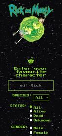
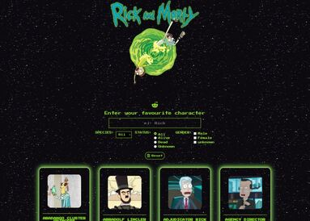

# **RickandMortySearchEngine**

Module 3 final project of the Adalab Digital Frontend Development Bootcamp.

This is a responsive Rick and Morty search engine app developed with [](https://html.spec.whatwg.org/) [](https://www.w3.org/Style/CSS/) and [](https://es.reactjs.org/).

## **Quick start guide**

Instructions to start this project:

### **Pre-requirements**

This project runs with [](https://es.reactjs.org/). Start guide [**here**](https://github.com/facebook/create-react-app).

### **Installation**

Once React has been installed:

1. Clone repository
2. Open a terminal
3. Run `npm install` on the terminal to install local dependencies

### **Run project**

Run `npm start` on the terminal:

1. Open the project on the browser using a local server.
2. Refresh browser everytime files contained in `/src` folder are updated.
3. Compiled files contained in `/src` folder and copy them in `/public` folder in order to be prepared for production environment.

### **Updating**

1. Run these commands to update changes on the project:

```
git add -A
git commit -m "Message commit"
git push
```

2. Run `npm run build` to create `/docs` folder and the production environment version.

3. Run again commands on step 1 to update changes on the project.

4. Project **[URL](https://anaguerraabaroa.github.io/RickandMortySearchEngine/#/)** is also available on GitHub Pages.

## **Exercise features**

- React app
- Get characters from [API](https://raw.githubusercontent.com/Adalab/rick-y-morty/master/data/rick-y-morty.json)
- Components structure
- Render an alphabetically ordered character list with image, name and species
- Form with filters by name (uppercase and lowercase), species, status and gender
- Detailed character card new window using React Router with image, name, species, status, origin planet and number of episodes. Use icons to render species and status
- Prevent event default of form
- Render error messages when searched character doesn't exist or when the URL of detailed character card doesn't exist
- Save search when user enter on detailed character card and go back to form
- Loading component
- Save data on LocalStorage
- Grid character list layout
- Responsive app design for mobile, tablet and desktop devices

## **Folder Structure**

```
RickandMortySearchEngine
├── docs
├── node_modules
├── public
├── src
│   ├── components
│   │   ├── App.js
│   │   ├── CharacterCard.js
│   │   ├── CharacterDetail.js
│   │   ├── CharacterList.js
│   │   ├── FilterByGender.js
│   │   ├── FilterByName.js
│   │   ├── FilterBySpecies.js
│   │   ├── FilterByStatus.js
│   │   ├── Filters.js
│   │   ├── Footer.js
│   │   ├── Header.js
│   │   └── Loading.js
│   ├── images
│   │    ├── background.gif
│   │    ├── header_image.gif
│   │    ├── header_logo.png
│   │    ├── rick_morty_mobile.jpg
│   │    ├── rick_morty_tablet.jpg
│   │    └── rick_morty_desktop.jpg
│   ├── services
│   │    ├── api.js
│   │    └── localStorage.js
│   ├── stylesheets
│   │   ├── core
│   │   │   ├── _reset.scss
│   │   │   └── _variables.scss
│   │   ├── layout
│   │   │   ├── _characterCard.scss
│   │   │   ├── _characterDetail.scss
│   │   │   ├── _characterList.scss
│   │   │   ├── _filterByGender.scss
│   │   │   ├── _filterByName.scss
│   │   │   ├── _filterBySpecies.scss
│   │   │   ├── _filterByStatus.scss
│   │   │   ├── _filters.scss
│   │   │   ├── _footer.scss
│   │   │   ├── _header.scss
│   │   │   └── _loading.scss
│   │   ├── pages
│   │   │   └── index.scss
│   │   └── App.scss
│   └── index.js
├── .gitignore
├── debug.log
├── LICENSE
├── package-lock.json
├── package.json
└── README.md
```

## **Components and functions**

### **App component**

- **Handle app:** function App()
- **Handle api, loading and LocalStorage lifecycle:** useEffect()
- **Handle form filters:** const handleFilter
- **Handle reset form filters:** const handleClick
- **Render filters**: const filteredCharacters, const characterGender, const filteredCharacterGender
- **Render detailed character card**: const renderCharacterDetail

### **Loading component**

- **Render loading:** const Loading

### **Header component**

- **Render header:** const Header

### **Filters component**

- **Render form and prevent event default**: const Filters

### **FilterByName component**

- **Event listener**: const handleFilter
- **Render filter**: const FilterByName

### **FilterBySpecies component**

- **Event listener**: const handleFilter
- **Render filter**: const FilterBySpecies

### **FilterByStatus component**

- **Event listener**: const handleFilter
- **Render filter**: const FilterByStatus

### **FilterByGender component**

- **Event listener**: const handleFilter
- **Render filter**: const FilterByGender

### **CharacterList component**

- **Render alphabetically ordered list of Pokemon:** const CharacterList, const sortCharacterList
- **Render individual character card component:** const characterItems
- **Render search error message:** const searchResults

### **CharacterCard component**

- **Render individual character card data:** const CharacterCard

### **CharacterDetail component**

- **Render detailed character card data:** const CharacterDetail
- **Render species icon on detailed character card data:** const renderIconSpecies
- **Render status icon on detailed character card data:** const renderIconStatus

### **Footer component**

- **Render footer:** const Footer

## **Project captures**

  

## **License**

This project is licensed under [**MIT License**](https://spdx.org/licenses/MIT.html).
